# 血流红中-十二星座

### 介绍
血流麻将包含两个玩法，十二星座和血流红中。

| 类型      | 链接                                                          |
|---------|-------------------------------------------------------------|
| 大厅服源码   | https://gitee.com/cyntc_1061451899/poker-majiang-dating.git |
| 游戏服源码   | https://gitee.com/cyntc_1061451899/poker-majiang.git        |
| web端演示  | https://admin.hfdsdas.cn/majiang                            |
| 移动端H5演示 | https://admin.hfdsdas.cn/majiang                            |

### 支持功能
- 血流麻将-十二星座玩法，仿指尖麻将-十二生肖玩法
- 去除麻将筒牌，使用十二星座牌替代，使用波塞冬，宙斯，雅典娜牌作为癞子牌
- 大厅活动包含幸运抽奖，登录礼包，游戏圈，开运好礼，新手宝典，充值派对，成就，新人福利，商城，邮件，背包，战绩
- 拥有丰富的页面交互和特效
- 支持移动端（由cocos开发，可打包H5、APP和小游戏）
- 支持简易后台管理，包括工作台数据统计，用户管理、数据汇总、系统设置等
- 项目持续更新中，每周发一次版本。

### 软件架构

后端技术栈：`nodejs8.11.2 + rabbitmq 3.8.9 + mongodb 3.4 + redis 3.2.8`
客户端技术栈：`cocos3.8.1+js`
管理后台技术栈：`vue2+element-UI`


### 安装教程
> 安装程序需要有一定的PHP经验和服务器运维经验，如果没有请加入交流群联系作者，作者提供付费部署服务！

#### 准备工作

需要先安装好运行环境，推荐使用docker，建议使用nginx作为服务器，不建议使用apache。需要安装以下软件：
|  所需环境 | 版本 | 备注 | 推荐版本 |
| --------- | ---- | ---- | ---|
| linux    | >= 7.0 |  以下的版本未做测试   | 7.9 |
| nginx    | >= 1.17 |     | 最新的 |
| nodejs | = 8 |  8    | 8.11.2 |
| mongo    | = 3.4 | 必须要3.4版本     | 3.4 |
| redis    | = 3.2.8 |     | 3.2.8 |
| rabbitmq    | = 3.8.9 |  用于消息服务部署  | 3.8.9 |

#### 源码下载
- 克隆代码到本地：
```
git clone https://gitee.com/cyntc_1061451899/poker-majiang.git
```
- 进入项目目录，执行：
```
npm install
```

- docker安装redis,rabbitmq,mongo
```
- 安装redis: docker run -p 6379:6379 --name redis -d redis redis-server --requirepass "qazwsx123!!"

- 安装rabbitmq: docker run -p 5672:5672 -p 15672:15672 --namer rabbitmq-server -d rabbitmq:3.8.9-management

- 安装mongodb: docker run --name data-mongo-1 -p 27017:27017 -d mongo:3.4
```

- 启动服务器
```
pm2 startOrRestart ecosystem.config.js
```

- docker启动效果图
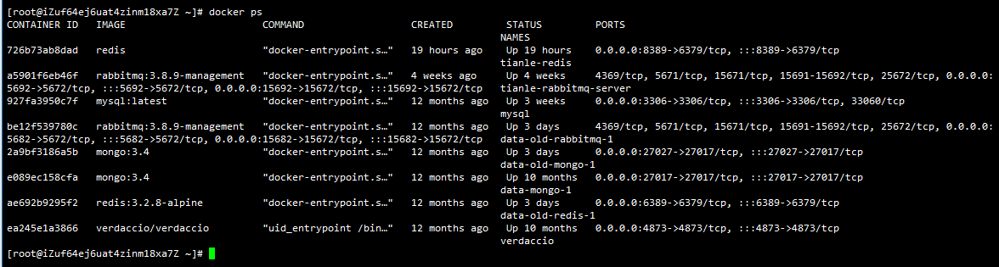

- 启动效果图
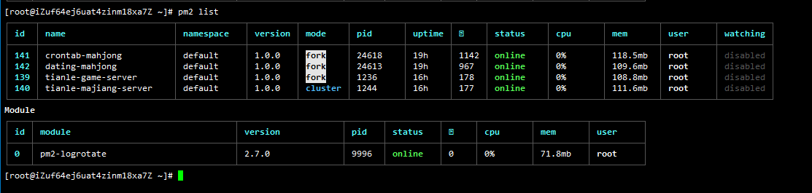

- 设置nginx代理

```
server {
	listen       80;
	listen       [::]:80;
	server_name game.mahjong.com;

    #血流游戏服务
	location /gameWs {
		proxy_pass http://127.0.0.1:9597;
		proxy_set_header X-Forwarded-For $proxy_add_x_forwarded_for;
		proxy_set_header X-Real-IP $remote_addr;
		proxy_http_version 1.1;
		proxy_set_header Host $host;
		#让代理服务端不要主动关闭客户端的连接
		#proxy_ignore_client_abort on;

		proxy_read_timeout 300s;
		proxy_send_timeout 300s;
		proxy_set_header Upgrade $http_upgrade;
		proxy_set_header Connection $connection_upgrade;
	}
}
```

- 如果有域名并且需要配置证书来开启HTTPS，可以使用免费的 `Let's Encrypt` 证书，如果不需要这些服务，可以直接使用HTTP协议,小游戏服务必须配置https。

### 安装部署服务

作者提供本系统的安装服务，包括后端和前端部署到线上，保证项目的完美运行，200元/次，安装服务可赠送详细的安装教程以及接口文档，如有需要可以进群联系作者！

### 交流群
如果有什么问题，请留言，或者加入我们的QQ群！

创作不易，点个star吧

[QQ 交流群：642610895](http://qm.qq.com/cgi-bin/qm/qr?_wv=1027&k=AjhXh31lV0NPJz3qAQ9J1Ui0yY8lDeNH&authKey=fnAhcR90n%2FEEYqWVr9IoBw9JjCdnU1P8yJ58Rq9esmvq3Fj%2FTUux%2FQcUvU92W7dE&noverify=0&group_code=642610895)

页面展示：
- 登录页面(支持游客登陆和微信登陆)
- 

- 大厅页面
- 

- 个人信息页面
- 

- 幸运抽奖界面
- 

- 登陆礼包界面(每日登陆礼包)
- 

- 游戏圈界面(接入小游戏游戏圈)
- 

- 开运好礼(每日开运领金豆)
- 

- 新手宝典(包括新手7日签到，初见引导，新人首充)
- 
- 
- 

- 充值派对(包括1元档，6元档，30元档福利)
- 
- 
- 

- 成就(包括成长成就，对局成就，玩法成就，特殊成就)
- 
- 
- 
- 
- 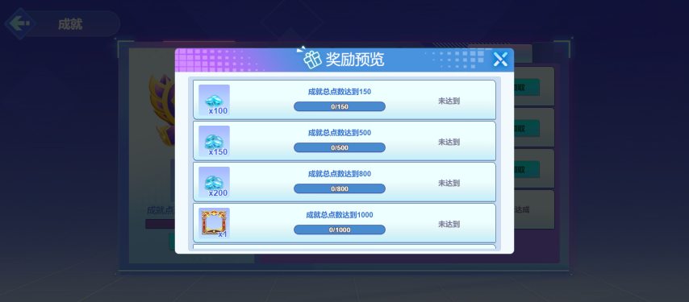

- 新人福利
- 

- 商城(包含金豆，钻石，代金券，头像框，称号，靓号购买)
- 
- 
- 
- 
- 

- 战绩
- 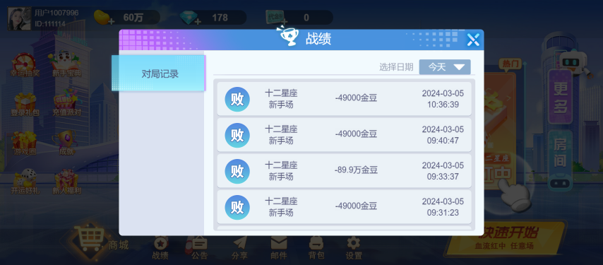

- 邮件
- 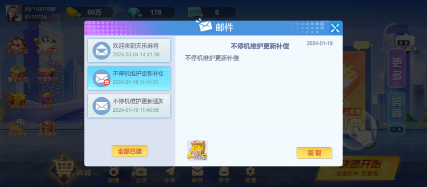

- 背包
- 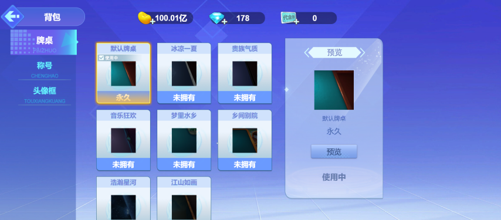
- 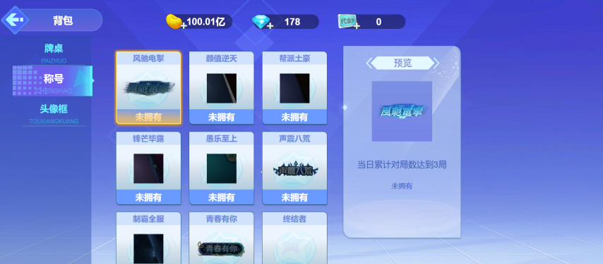
- 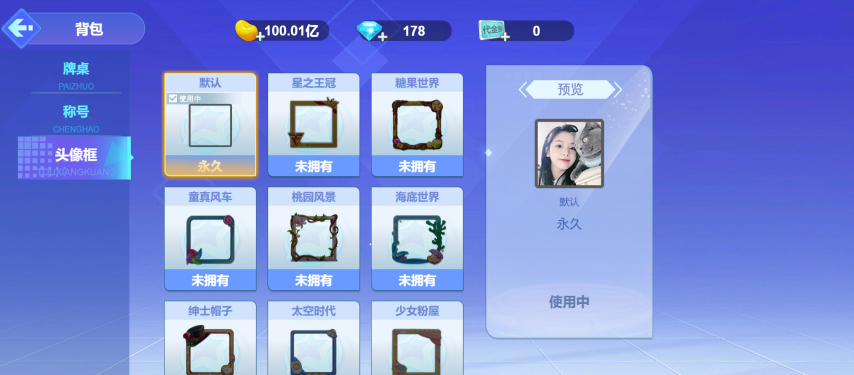

- 场次选择
- 

- 对局匹配界面
- 

- 开局特效
- 

- 对局页面
- 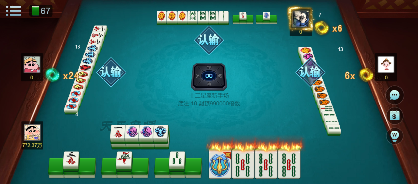
- 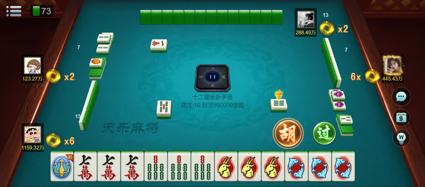

- 特效展示
- 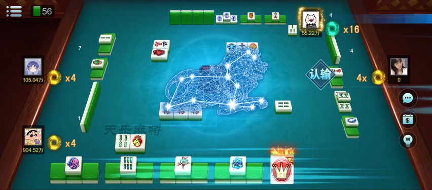
- 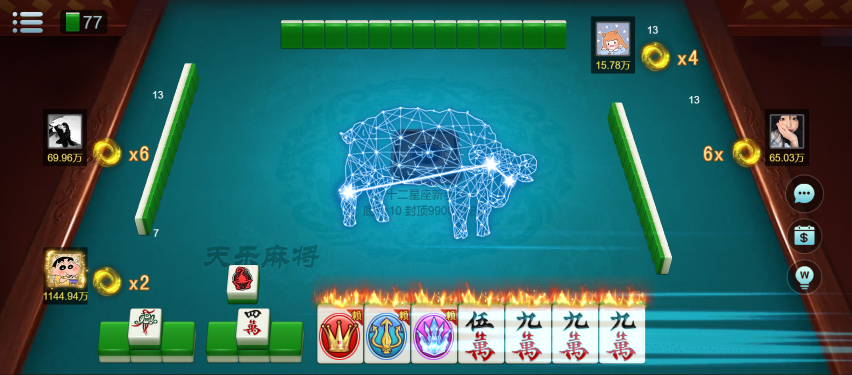
- 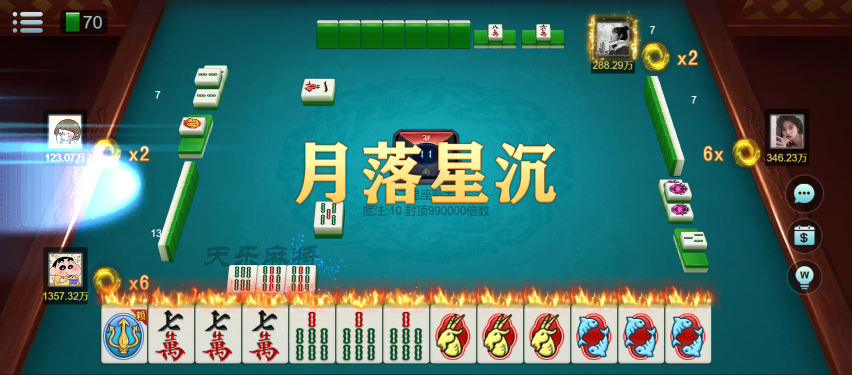
- 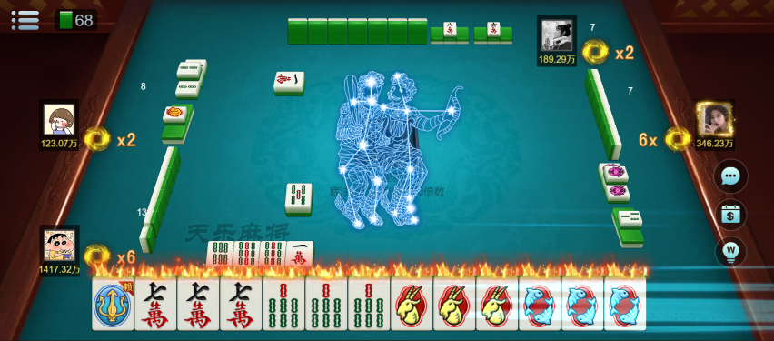

- 结算界面
- 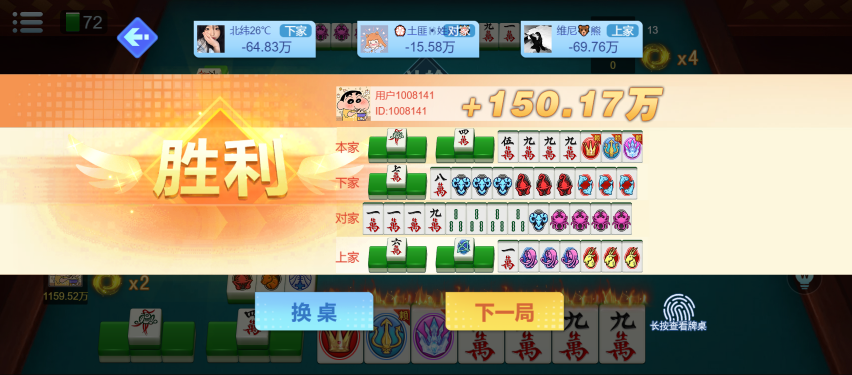

- 对局超值礼包
- 

- 救济金
- 

- 破产礼包
- 

- 游戏破产提前离场
- 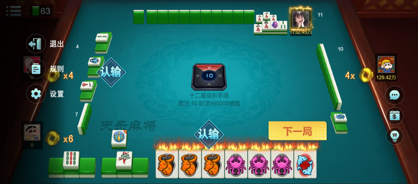
